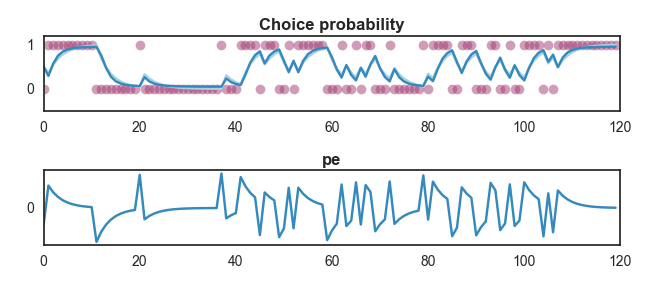
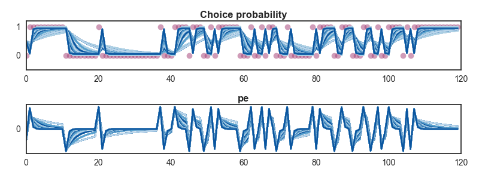
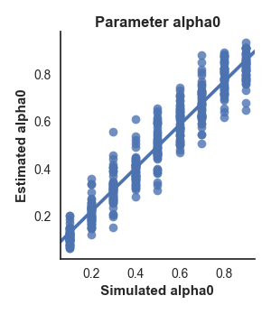
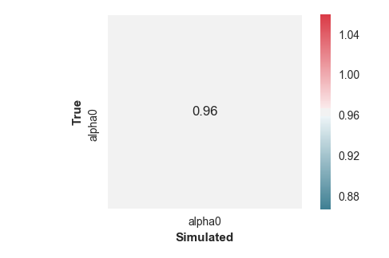
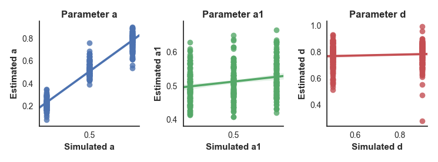
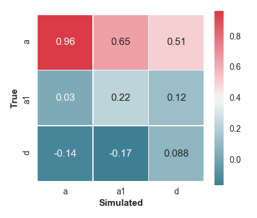

Simulation
""""""""""

Simulation is an important step to check that models produce expected patterns of behaviour. The process involves taking a series of task stimuli and feeding them into a learning model and observation model with a given set of parameter values to produce behaviour predicted by these particular parameter values.

To facilitate this process, the ``RLModel`` class has a ``simulate`` method, that provides the ability to simulate behaviour for a given model across parameter values, and produces outputs necessary to evaluate the simulated behaviour.

At a basic level, the ``simulate`` method can be called with a series of outcomes (e.g. reward/no reward for a given stimulus) as a .txt file or a numpy array, along with dictionaries of parameter values for the learning and observation models. For example:

.. code-block:: python

        model.simulate(outcomes, learning_parameters={'value': 0.5, 'alpha':0.3},
                       observation_parameters={'b':3})

This will simulate behaviour according to the model's responses to the given outcomes at the provided parameter values. By "behaviour" here we refer to the probability of choosing a given action. The ``simulate`` method will also produce plots of the simulated probability, along with any other variables provided by the learning and observation models (such as prediction errors or any other values returned by the model functions).

It can be useful to save the output of a simulation run to a file in the same format as real subjects' data, and it is possible to do this by providing a value for the ``response_file`` argument of the ``simulate`` method. This will simulate choices on each trial based on the calculated probability of choosing a given action, and write these to a response file, along with subject IDs (subjects are named after the model parameters used to simulate them) and columns listing the provided parameter values for the simulation.

.. code-block:: python

        model.simulate(outcomes, learning_parameters={'value': 0.5, 'alpha':0.3},
                       observation_parameters={'b':3}, response_file='sinulated_data.csv')

It is also possible to simulate multiple subjects by providing a value for the ``n_subjects`` argument of the ``simulate`` method. This will generate additional sets of randomly determined choice data for each subject.

Results of the simulation are saved in the ``simulated`` attribute of the model instance. This takes the format of a list containing the results of each simulation performed with the model. Each list entry is a tuple of the form (learning parameters used for simulation, observation parameters used in simulation, simulation results). The simulation results take the form of a dictionary with entries representing the name of every variable returned by the model (e.g. estimated value, action probability, prediction errors etc.) and their value. This makes it relatively simple to access results from a range of simulations. For example, to retrieve the prediction errors given by the most recent simulation, we can use the following code.

    >>> prediction_errors = model_rw.simulated[-1][2]['pe']
    >>> print prediction_errors[:10]
    [-0.5  0.65  0.455  0.3185  0.22295  0.156065  0.1092455  0.07647185  0.0535303  0.03747121]

.. note:: The position of the values returned by the ``simulate`` method relative to each trial is important to be aware of, and differs depending on the type of variable being returned. The estimated value, and any other variable that is entered into the learning model's calculation at each step is provided *prior* to the model seeing the outcome of the trial. For instance, if we set the initial estimated value at 0.5, the estimated value in the first trial of the simulated data will be 0.5. In contrast, other outputs (such as prediction errors) are provided on the same trial as the outcome. So for example the first prediction error would be the prediction error produced by the first trial.

If multiple subjects are simulated, the arrays for each variable returned by the simulation become two-dimensional (n_trials, n_subjects).

    >>> prediction_errors_multisubject = model_rw.simulated[-1][2]['pe']
    >>> print prediction_errors_multisubject.shape
    (120L, 3L)

Parameter recovery
""""""""""""""""""

Parameter recovery tests the ability to determine parameter values from observed behavioural data simulated with known parameter values. For example, if we simulated behaviour using a Rescorla-Wagner learning model with an alpha value of 3, our model fitting procedures should return an alpha value of 3 when we attempt to fit a Rescorla-Wagner model to this data. DMpy provides a couple of functions to assist with this process. Firstly, when data is simulated using the ``RLModel`` class ``simulate`` method and saved to a csv file, the generated response file will include columns containing the values of each parameter used to simulate the data.

If a response file including these columns is fed into any of the ``RLModel`` class's fit methods, it will automatically include these values in its output table for each subject and estimate Pearson correlations between the true and recovered parameter values (saved in the ``.recovery_correlations`` attribute of the model), along with producing plots to illustrate these.

In order for this to work properly, it's advisable to simulate across a range of parameter values. This is simple to do by providing lists of values in the parameter dictionary rather than single values. If multiple values are provided for more than one parameter, all possible combinations of these parameter values will be simulated. Be aware that if many parameter values are provided, this can rapidly lead to a *very* large number of simulated datasets and cause problems!

This is an example of parameter recovery with a Rescorla-Wagner model, where we're assessing our ability to recover the alpha parameter. To simulate across a range of values of alpha, we provide a range from 0.1 to 0.9 in steps of 0.1 using ``np.arange(0.1, 1, 0.1)``.

        >>> sim_rw = model_rw.simulate(outcomes, n_subjects=50,
                                       response_file='parameter_recovery.csv',
                                       learning_parameters={'value': 0.5, 'alpha0': np.arange(0.1, 1, 0.1)},
                                       observation_parameters={'b':3})
        Finished simulating
        Saving simulated responses to parameter_recovery.csv

The simulation plots also now plot estimated probabilities and other values across the range of parameter values provided.

If we now fit our model to this data, we can see whether the alpha parameter is recovered successfully.

    >>> model_rw.fit_MAP(outcomes, sim_rw)
    Loading data
    Loading multi-subject data with 450 subjects
    Loaded data, 450 subjects with 120 trials

    -------------------Finding MAP estimate-------------------

    Performing model fitting for 450 subjects

    Optimization terminated successfully.
     Current function value: 21874.952537
     Iterations: 45
     Function evaluations: 72
     Gradient evaluations: 72

     Performing parameter recovery tests...
               alpha0                   Subject  alpha0_sim  value_sim
        0    0.172732    alpha0.0.1.value.0.5_0         0.1        0.5
        1    0.129099    alpha0.0.1.value.0.5_1         0.1        0.5
        2    0.146754   alpha0.0.1.value.0.5_10         0.1        0.5
        3    0.111058   alpha0.0.1.value.0.5_11         0.1        0.5
        4    0.127479   alpha0.0.1.value.0.5_12         0.1        0.5

    Finished model fitting in 30.8701867692 seconds

The parameter table has our simulated values in addition to the estimated values for each subject, and these are saved in the model's ``.parameter_table`` attribute.

Additionally, the fitting method produced two figures: a scatter plot showing the relationship between the true and estimated alpha values, and a correlation matrix showing the correlation between every estimated parameter in the model (in this case there is only a single value so it's a pretty uninteresting matrix).

To illustrate this more clearly, let's look at an example of a more complex model for which parameters aren't recovered so accurately...

    >>> model_1lr.fit_MAP(outcomes, complex_model)

    Finished model fitting in 61.4955701763 seconds

We can see from the plots that it doesn't look good. The a parameter is estimated successfully, as shown by the scatter plot and a correlation of .96 between the true and estimated values in the correlation matrix. However, the other two parameters show poor correlations between true and estimated values, indicating that we're not able to recover them successfully.

